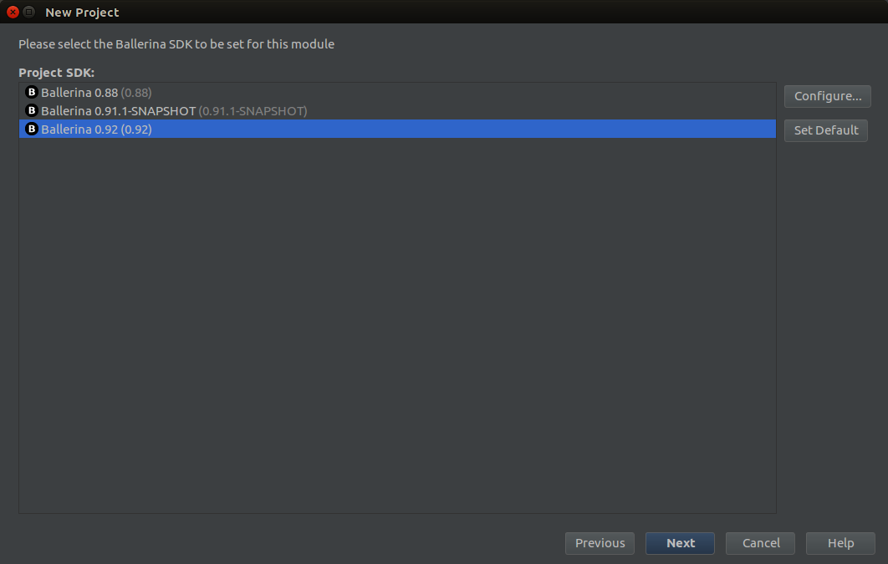
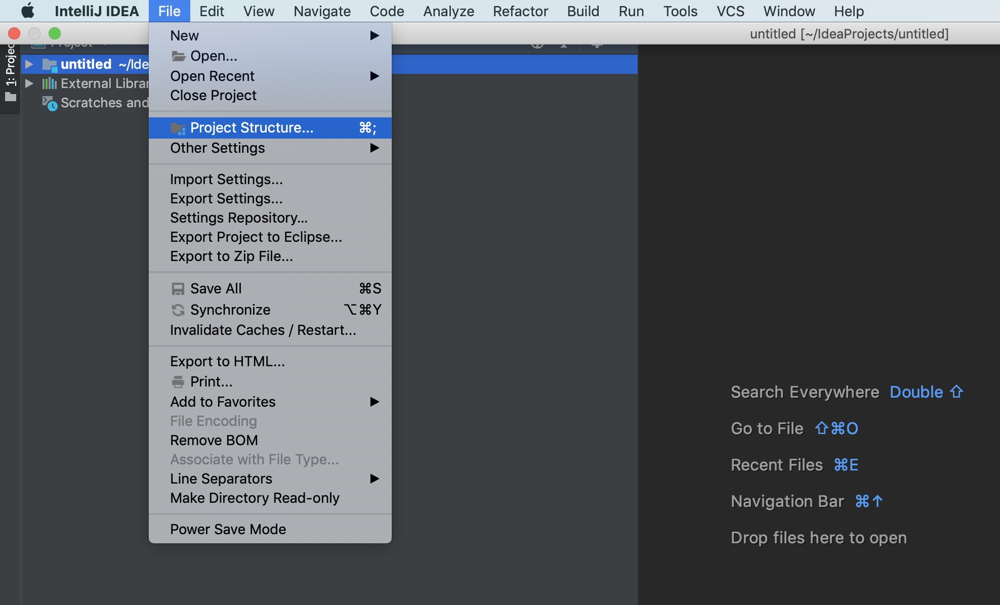
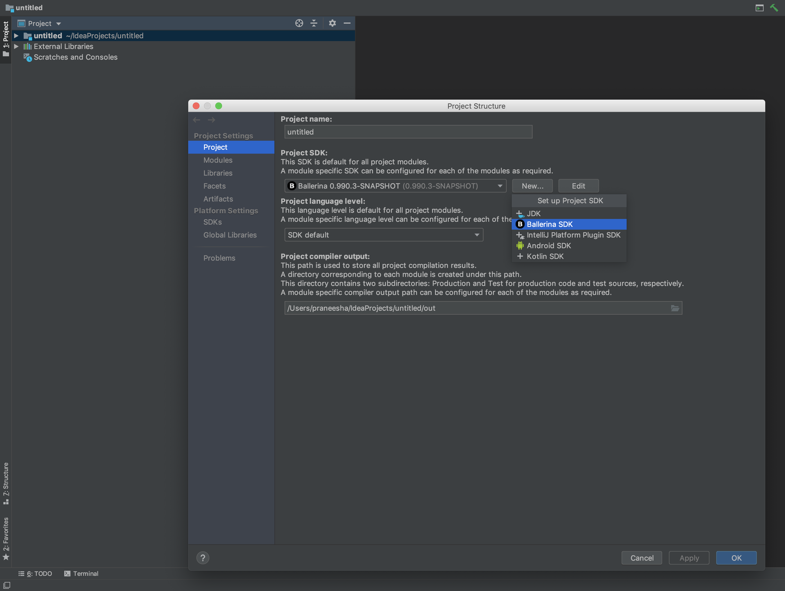
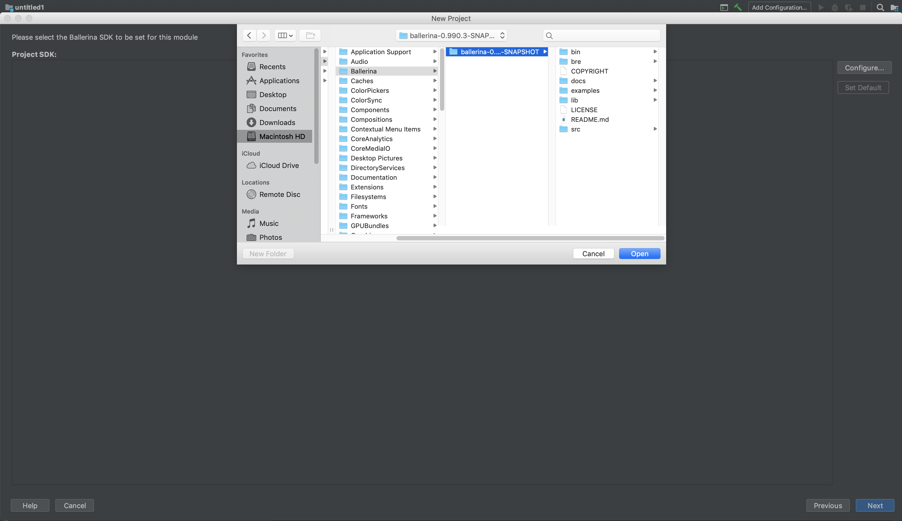
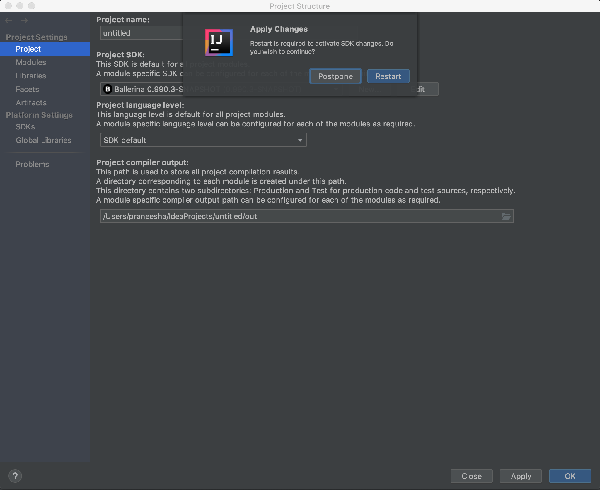
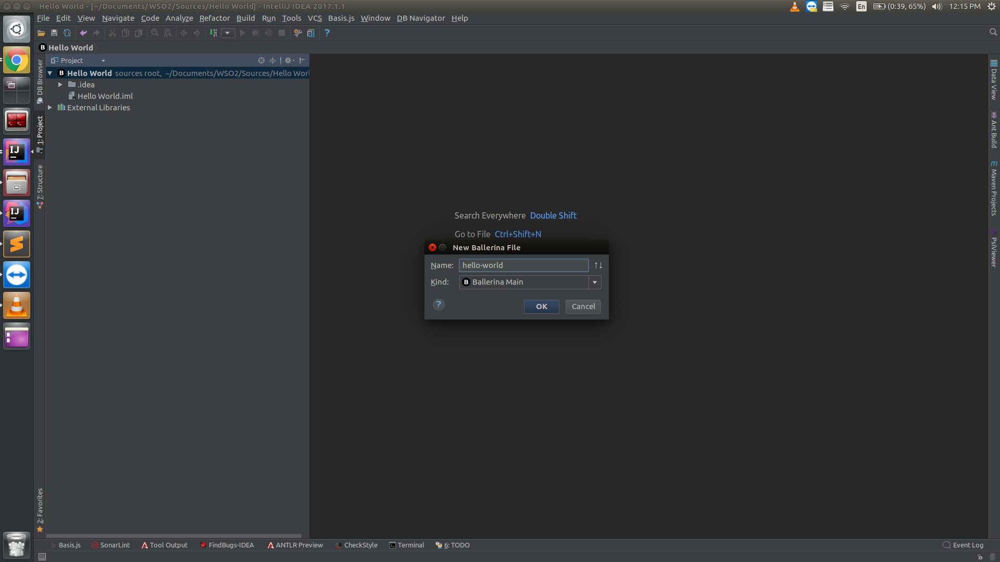

# Using the IntelliJ Ballerina Plugin

Click the links below to start using the IntelliJ Ballerina plugin after [installing it](../intellij-plugin.md).

- [Creating a new Ballerina project](#creating-a-new-ballerina-project)
- [Setting up Ballerina SDK for an existing project](#setting-up-ballerina-sdk-for-an-exisitng-project)
- [Creating a new Ballerina file](#creating-a-new-ballerina-file)

## Creating a new Ballerina project

Follow the steps below to create a new Ballerina project.

1. Open the editor, click **File** in the top menu, click **New**, and then click **Project**.

2. Select **Ballerina** as the type of the project, and click **Next**.

3. Select a Ballerina SDK for the project, and click **Next**.

    >**Tip:** **If you do not have an already-configured Ballerina SDK to select,** click **Configure**, select the location of the Ballerina distribution, click **Open**, and then click **Next** to continue with the project creation.

    
   
4. Enter a name for the project, a location to save it, and click **Finish**.

    

Now, you have successfully created a new Ballerina project.

## Setting up Ballerina SDK for an existing project

1. Open the Project to which you want to set up a Ballerina SDK.
2. In the editor, click **File** in the top menu, and then click **Project Structure**.

    
3. If you do not have an already-configured Ballerina SDK, in the **Project** tab, click **New** under **Project SDK:**, click **Ballerina SDK**, and then click **OK**. 

    >**Tip:** If you have already-configured Ballerina SDKs, select one under **Project SDK:**, and click **OK** to continue.

    
4. Select the location of the Ballerina distribution and click **Open**.

    
5. Click **Apply** to save the changes.

    

    >**Tip** This prompts a restart request. Click **Restart** to apply the changes.

 Now, you have successfully added the Ballerina SDK to an existing project.

## Creating a new Ballerina file

Follow the steps below to create a new Ballerina file within a Ballerina project.

1. Right-click on the name of the project, click **New**, and then click **Ballerina File**.

    

2. Enter a name for the file, and click **OK**. 

    > **Tip:** In this example, since the default **Main** template is selected as the **Kind**, it creates a new file with a main function.

    

Now, you have successfully created a new Ballerina file with a **main** function.

## What's next?

 Next, for information on using the features of the IntelliJ Ballerina plugin, see [Using the IntelliJ plugin features](#using-interllij-plugin-features).
 

 